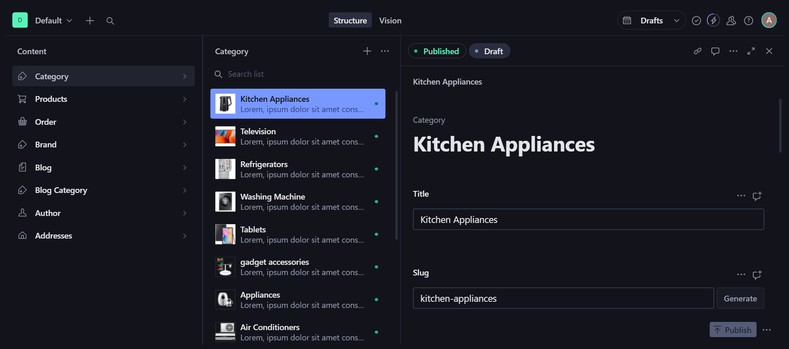
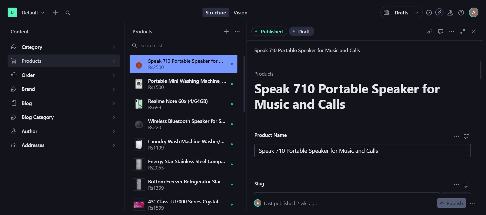
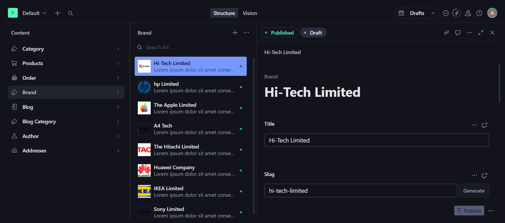
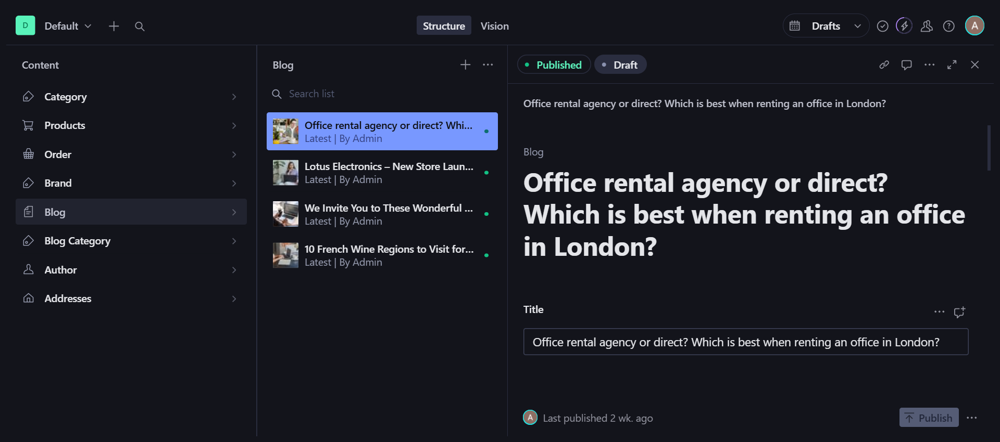
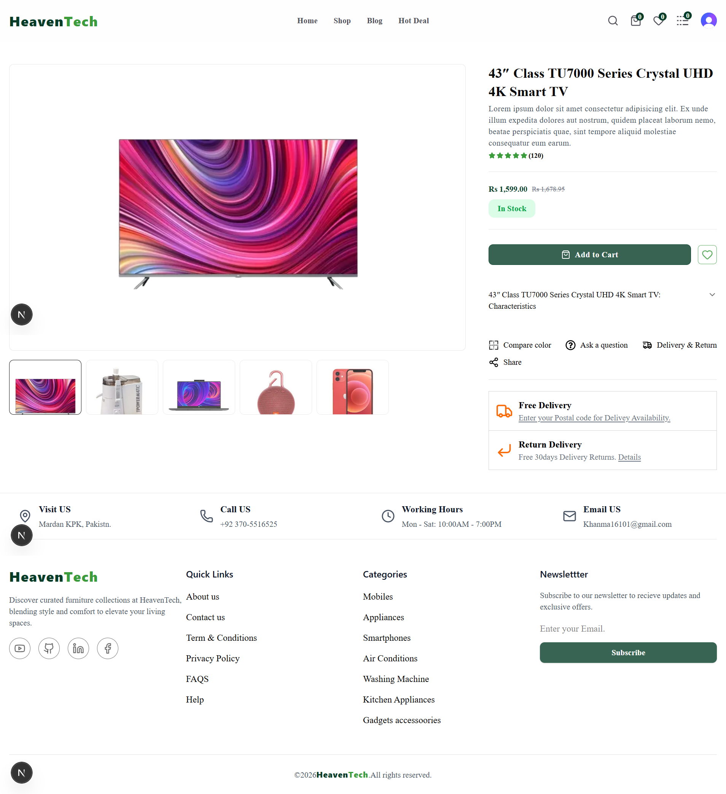
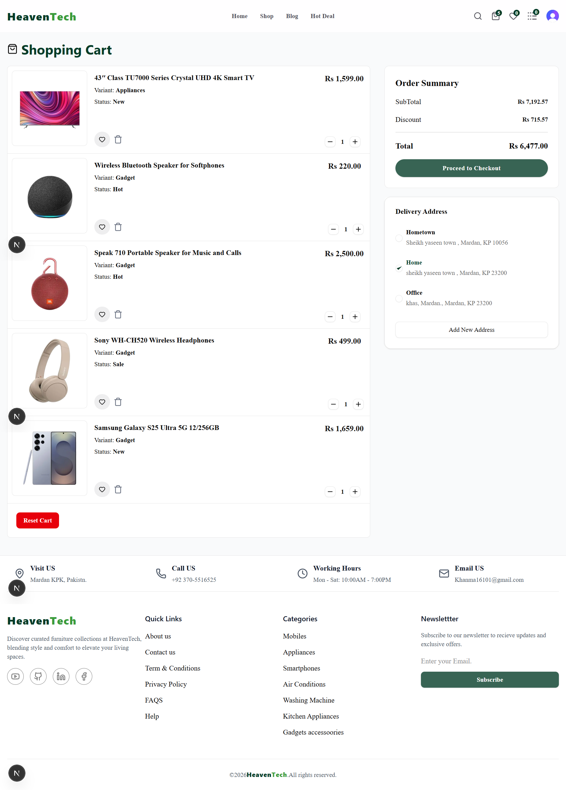
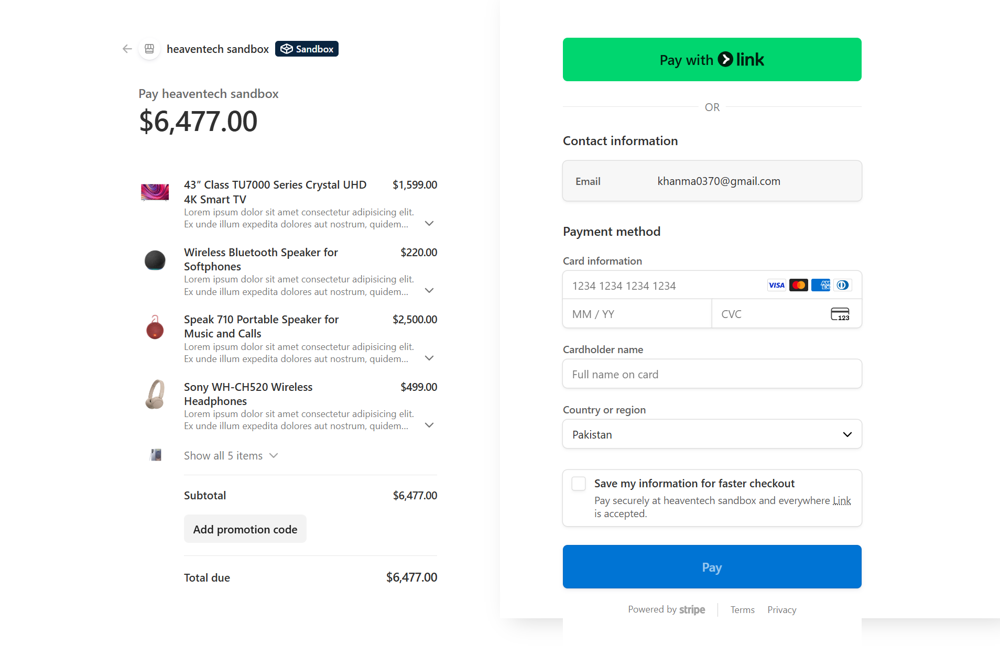

## 🛒 HeavenTech Store

A modern full-stack e-commerce web application built with Next.js, Tailwind CSS, Clerk Authentication, Framer Motion, Sanity CMS, and Stripe.
This project features a fully functional shopping experience, secure authentication, admin dashboard, product management, order tracking, wishlist, and online payments.

🔗 Live Demo: https://heaventech-store.vercel.app
 📂 Repository: https://github.com/AzharAli-web/Heaventech-store

## 🚀 Features
### 🔐 Authentication (Clerk)

Secure Signup & Login
Session management
Protected routes for authenticated users
User profile handling

### 🛍️ Shopping Experience

Product listing page with search and filters
Product detail view
Add to cart / Remove from cart
Dynamic quantity updates
Real-time total price calculation
Smooth UI interactions
Wishlist / Featured products — add/remove favorites

### 💳 Payments (Stripe)

Secure payment processing
Checkout with live Stripe integration
Real-time order confirmation

### 🎬 Animations (Framer Motion)

Page transitions
Smooth component animations
Interactive hover effects
Animated cart updates

### 📱 Responsive Design

Mobile-first layout
Fully responsive (Mobile / Tablet / Desktop)
Modern UI built with Tailwind CSS

## 🧱 Tech Stack
### Frontend

Next.js (React)
Tailwind CSS
Framer Motion

### Authentication

Clerk

### Backend / CMS

Sanity Studio (Headless CMS)
Next.js API Routes

### Payments

Stripe

### Deployment

Fully deployed on Vercel

## 📂 Project Structure
HeavenTech-Store/
├── app/ or pages/            # Next.js application routes
├── components/               # Reusable React components
├── hooks/                    # Custom React hooks
├── images/                   # Static images used in the app
├── lib/                      # Clerk authentication setup & utility functions
├── sanity/                   # Sanity CMS configuration and schemas
├── screenshots/              # Screenshots for README / portfolio
├── constants/                # Constant data used across the project
├── data.ts                   # Sample data for products or categories
├── eslint.config.mjs         # ESLint configuration
├── next.config.ts            # Next.js configuration
├── package.json              # Project dependencies
├── package-lock.json
├── postcss.config.mjs        # Tailwind/PostCSS configuration
├── proxy.ts                  # API proxy (if used)
├── sanity.cli.ts             # Sanity CLI config
├── sanity.config.ts          # Sanity Studio config
├── sanity.types.ts           # TypeScript types for Sanity
├── schema.json               # Sanity schema file
├── seed.tar.gz               # Optional seed data
├── store.ts                  # Cart or store state management
├── stripe.exe                # Stripe helper / CLI file
├── tsconfig.json             # TypeScript configuration
├── .gitignore
└── README.md

## 🔐 Admin Panel / CMS (Sanity Studio)

The project includes a Sanity Studio admin panel for managing products, categories, brands, and other site content.
Note: Admin access is private for security reasons. Screenshots below illustrate all functionality.

### Available in Admin

Add / Edit / Delete products, categories, brands, and blog content
Full control over all site data
Manage featured products dynamically
Track orders with unique IDs for accurate order management

### Screenshots:

(Add your actual screenshots here)

### 🧠 What I Learned

Through this project, I strengthened my understanding of:
Implementing secure authentication using Clerk
Building animated UI with Framer Motion
Managing global state in React
Creating reusable components
Integrating a headless CMS (Sanity) for dynamic content
Deploying production apps on Vercel
Integrating Stripe for secure payment processing
Building a fully functional e-commerce platform with order tracking and wishlist features

## 🛠️ Installation & Setup

### Clone the repository:

git clone https://github.com/AzharAli-web/Heaventech-store.git
cd Heaventech-store

### Install dependencies:

npm install

### Run the development server:

npm run dev

Open http://localhost:3000
 to view it.

## Environment Variables:

### Clerk Authentication
NEXT_PUBLIC_CLERK_PUBLISHABLE_KEY=your_clerk_publishable_key
CLERK_SECRET_KEY=your_clerk_secret_key

### Sanity CMS
NEXT_PUBLIC_SANITY_PROJECT_ID=your_sanity_project_id
NEXT_PUBLIC_SANITY_DATASET=your_sanity_dataset
SANITY_API_READ_TOKEN=your_sanity_read_token
SANITY_API_TOKEN=your_sanity_write_token

### Stripe Payments
STRIPE_SECRET_KEY=your_stripe_secret_key
STRIPE_WEBHOOK_SECRET=your_stripe_webhook_secret

### App URLs
NEXT_PUBLIC_BASE_URL=http://localhost:3000
NEXT_PUBLIC_APP_URL=https://heaventech-store.vercel.app/

## 📸 Screenshots (Frontend)

Add screenshots of your live website:

## 🎯 Features Already Implemented

Full Admin Dashboard – Add, edit, or delete any product, category, or content directly from Sanity Studio. Complete control over the site’s content.
Order History & Tracking – Each order is automatically assigned a unique ID, allowing users to track their orders.
Product Search & Filtering – Users can search products and filter by categories or attributes directly on the shop page.
Wishlist / Featured Products – Users can add products to their wishlist/favorites and remove them anytime. Featured products are highlighted dynamically.
Stripe Payments – Fully functional secure payment integration for live orders.
All of these features are live and fully functional in the deployed site.